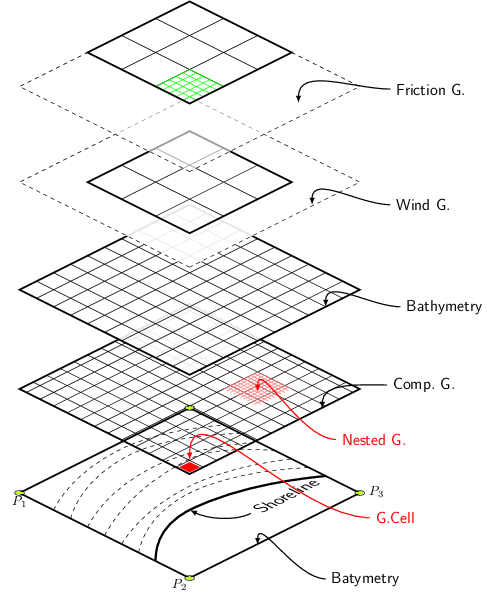

tikz2pdf
========

TikZ is for print what [D3](http://d3js.org/) is for web. If you are unfamiliar with this nifty LaTeX package, then [this gallery of examples](http://www.texample.net/tikz/examples/all/) will convince you to use TikZ for your next publication.

**tikz2pdf** is a command-line tool to aid you in creating beautiful figures.
It's written in Python and (only) requires a [working TeX system](http://en.wikibooks.org/wiki/LaTeX/Installation). 

Basic Usage
-----------

Let's say we have a file named `hello.tikz`, which contains the following:

```latex
\begin{tikzpicture}
	\node[circle, draw=blue, dashed, thick, rotate=30, font=\Large] {Hello World!};
\end{tikzpicture}
```

Run `tikz2pdf hello.tikz` from the command-line in order to compile this into a PDF file named `hello.pdf`.

You can convert this PDF to PNG with [ImageMagick](http://www.imagemagick.org/script/index.php):

```bash
convert -flatten -density 96 -quality 1000 hello.pdf hello.png
```

to get the following image:


Templates
---------

Templates are useful for when you have many figures that need the same styling (i.e., LaTeX preamble). The following is the minimal template that is used when no template is specified:

```latex
\documentclass{article}
\usepackage{tikz}
\pagestyle{empty}
\usepackage[active,tightpage]{preview}
\PreviewEnvironment[]{tikzpicture}
\PreviewEnvironment[]{tabular}
\begin{document}
%tikz2pdf-tikz
\end{document}
```

The string `%tikz2pdf-tikz` is replaced with the actual TikZ code. If the TikZ file contains "documentclass" it is treated as as self-contained document and no template is used. So, the file `examples/swan-wave-model.tex`, which illustrates the [SWAN wave model](http://www.texample.net/tikz/examples/swan-wave-model/), can be directly converted to a PDF file:



Command-line options
--------------------

From `tikz2pdf --help`:

    positional arguments:
      TIKZ                  TikZ file(s)
    
    optional arguments:
      -h, --help            show this help message and exit
      -b BIN, --bin BIN     binary to use for compiling (default: pdflatex)
      -d, --debug           print debug information
      -e, --edit            open TikZ file in default editor
      -i, --interactive     start interactive session (same as -evw)
      -c INCLUDE_DIR, --include-dir INCLUDE_DIR
                            additional directory to add to TEXINPUTS
      -n N, --number N      number of iterations to compile (default: 1)
      -o [PDF [PDF ...]], --output [PDF [PDF ...]]
                            output PDF file or directory (with trailing slash)
      -p, --pdflatex        use pdflatex as compiler
      -q, --quiet           suppress compiler output
      -t TEX, --template TEX
                            LaTeX file to use as template
      -v, --view            open PDF file in default viewer
      -w, --watch           recompile when TikZ file or template has changed
      -x, --xelatex         use xelatex as compiler

Configuration
-------------


License
-------

BSD
